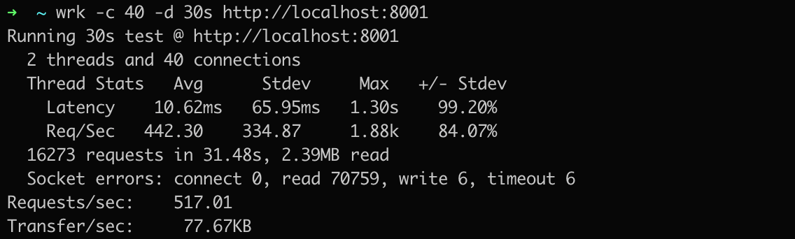
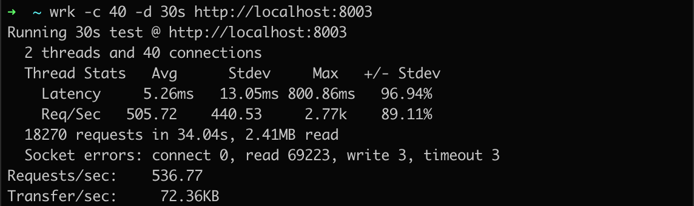
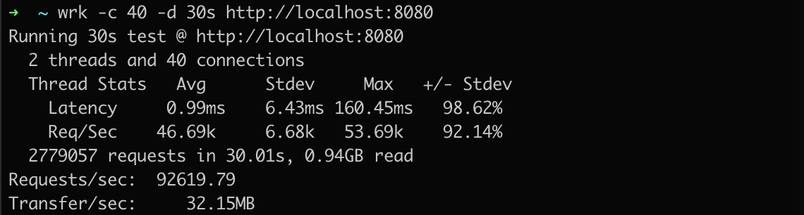

# 描述
http server 中是直接使用 Java 的 JDK 实现的最简单的 HTTP 服务示例
总共有 HttpServer01，HttpServer02，HttpServer03 三个示例，其中：
- HttpServer01 以单个线程来处理所有客户端的 HTTP 请求
- HttpServer02 每个请求创建一个线程来处理所有客户端的 HTTP 请求
- HttpServer03 构造创建了一个线程池，来处理所有客户端的 HTTP 请求

## 性能对比
### HttpServer01

### HttpServer02
MacOS系统，每次压 HttpServer02 电脑直接黑屏了，建议不要压测！

### HttpServer03

### HttpNettyServer01

通过上面的图可以看出，使用 Netty 做 HTTP 服务端不，性能非常不错